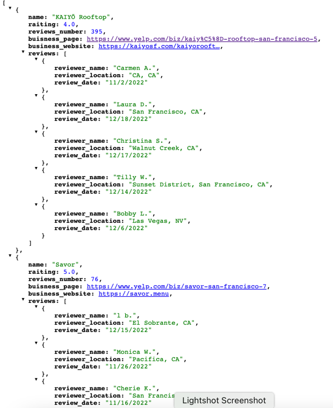

# Yelp Crawler
## Scraps businesses from [Yelp](https://www.yelp.com/) website.

## Installation

### Prerequisites
* Python 3.10+

### Steps to install
1. Clone the repository:
   ```shell
   git clone https://github.com/Aleksandro777/yelp-crawler.git
   ```
2. Install requirements:
   ```shell
   pip install -r requirements.txt
   ```

## How to use
### Running the script
1. Run the spider: scrapy crawl restaurants -O businesses.json

2. To parse another business and another location - select the appropriate category and location on yelp.com, copy the link and paste it into the start_urls variable

### Example output
